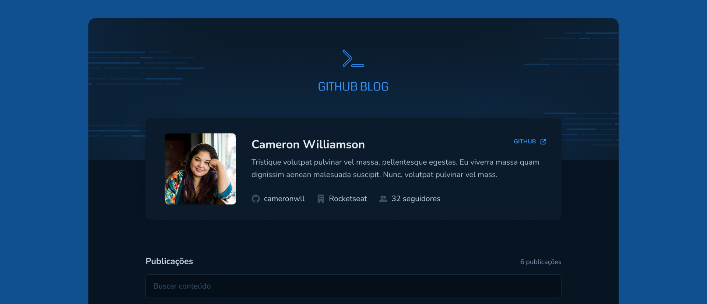

## 💻 Projeto

Esse projeto foi desenvolvido para o desafio do curso ignite da Rocketseat. Este projeto é um blog, utilizando das issues do repositório e da api do GitHub para simular posts.

## Iniciando o projeto

Instale as dependências com npm ou yarn.

Execute o projeto com npm run dev ou yarn dev.

## 🚀 Tecnologias

Esse projeto foi desenvolvido com as seguintes tecnologias:

- Vite
- React Js
- Typescript
- Axios
- Styled Components
- React Router DOM
- React Hook Form
- React Markdown
- React Icons

## Preview

